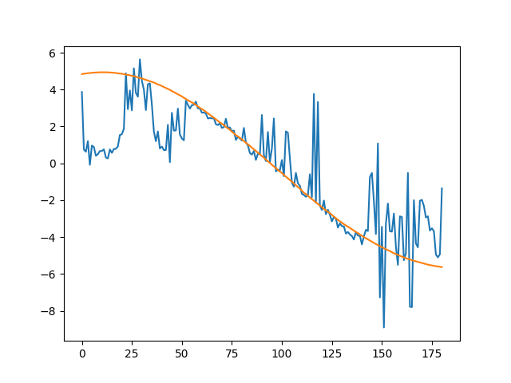
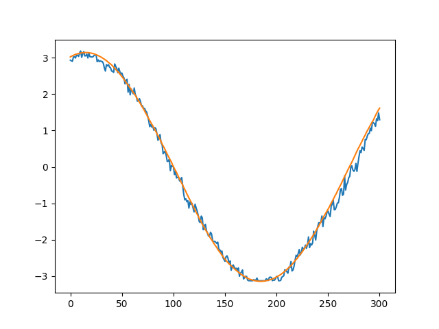
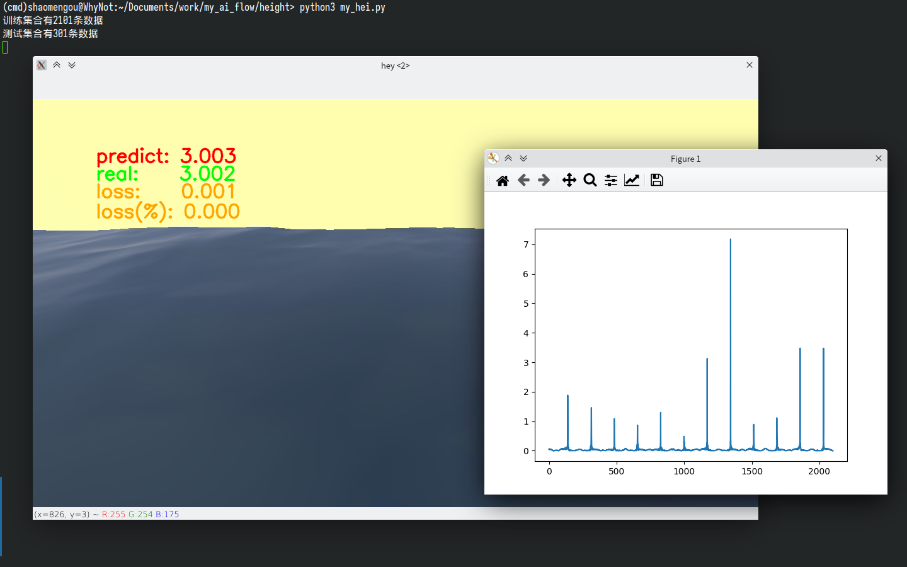

# 使用深度神经网络对虚拟水体进行水位预测

首先，有必要对标题做一个解释。我们的目标是“水位预测”，手段是“深度神经网络”。而一个可供使用的深度神经网络模型需要进行训练，而训练又需要数据，笔者没有条件进行“现实世界”的水位数据获取，所以自行搭建了一片虚拟海洋，你可以在[基于godot的虚拟水体搭建](https://github.com/ShaoMengou/water_flow)找到它，并获取训练数据（test.avi）。关于这片虚拟水体的演示视频，你可以在[【使用深度神经网络对虚拟水体进行水位预测】](https://www.bilibili.com/video/BV1EM4y1y73f/)找到。

于是，我们有了用户训练模型的数据。这个数据集合包含一段40秒的视频，帧数为60，我们会使用前35秒用作训练数据，最后5秒用于对比测试以检验模型准确度。考虑到笔者的电脑性能实在是太差了，所以我们不会使用一整张图片（1152\*648）进行训练，而是选取每个图像帧的最左侧那一列（1\*648）进行训练。实际上，从我们要达成的目标来看，这一策略也是值得考虑的，使用一整张图片完全没有必要，因为在摄像机水平的情况下，水平面和地平线应当是平行的，这意味着在图像中的每一列，“水面”所在的高度是相对一致的，所以我们只需要一列数据。

对于深度神经网络，输入层的数据是一个由648个float组成的列表（当然在pytorch中，我们使用的类型是Tensor）。在那之后，我们有三层隐藏层，每一层的“宽度”都是前一层的平方根，即64->16->4->2->1这样的模式。每一个神经元的输出都使用relu激活。最后，我们的输出层输出一个float，代表预测的水位。

其实，作为人类而言，我们是如何预测水位的呢？首先用眼睛看，我们往往能一眼看出水面和背景物的交界处。当然，“水天一色”这种情况就很难看出来了，这是因为颜色过于接近，没有变化可言，因此我们无法分辨“水”和“天”。所以，问题的关键在于找到这个变化的地方，变化最剧烈的地方，自然就是水位线了。用图像处理的话来说，就是“梯度极大值”。

为此，笔者使用ffmpeg从测试视频中取出一帧帧图像，在裁剪到最左一列（[:,0]）之后，进行灰度化（[r,g,b]->[float]），并手动遍历648个元素，获取梯度（after-=front），这样我们就完成了单个训练数据的“建立”。

接着就是训练。笔者训练了两次，两次的预测效果可以从下面两张图看出。

图中的橙色正弦曲线为实际水位，蓝色线为预测水位。可以看出，训练越多，预测效果越好。当然，对于笔者的电脑来说，这很要命，7+3的训练用了5分钟，35+5的训练用了90分钟左右（内存疯狂换页）。笔者使用的pytorch包为cpu版本（因为我没有很好的gpu......）

最后，笔者还做了一个用训练好的模型实时预测的GUI，看起来还挺像那么回事。

输入数据的标签为[-PI,PI]，可以看出，绝对误差还是比较小的，但会周期性的出现波动。

笔者猜测这些“不太准”的地方，可能是虚拟水位靠近0的地方，函数变化率大（sin'=cos），输入数据在这附近时便显得比较稀疏，模型便没有充分训练到位。也可能出现在PI附近，因为模型不知道PI之外的世界长什么样，所以结果牛头不对马嘴。当然，这一点也可以应用，我想，如果一片平缓的河流的预测水位数据开始乱飙（出现了没见过的数据），是否就可以拉响警报了呢？
